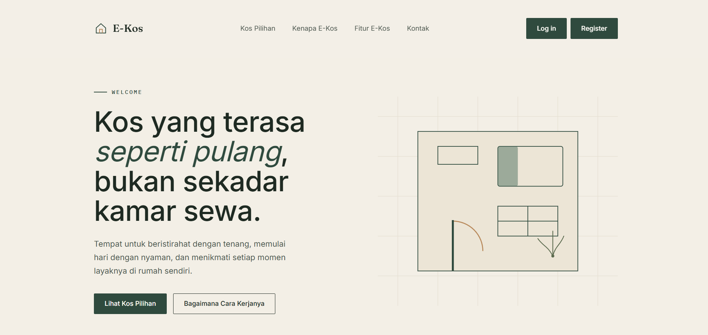
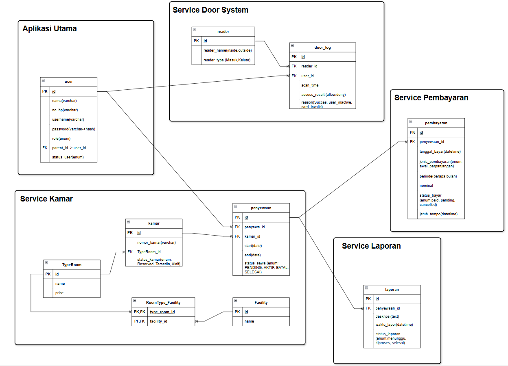

# E-Kos

## Desain Database

    

## Hak Akses Pengguna
#### Admin 
* Melihat dashboard
* Kelola Kamar (CRUD) & Update Status kamar
* Kelola Status (update status laporan)
* Melihat seluruh riwayat pembayaran
* Membuat custom Type room dan facility

#### Penyewa
* informasi pengguna
* Log keluar masuk dengan scan qr
* Laporan kerusakan secara online dan tracking status real-time
* informasi tentang kamar
* Riwayat Pemabayran dan perpanjangan
* Membuat akun orang tua

#### Orang Tua
* Melihat log keluar masuk anak mereka

## Tech Stack
- Laravel 13
- Laravel Breeze
- Docker (Laravel sail)
- Bootstrap 5
- Midtrans Snap (payment gateway)
- Rest API
- QR Code

## Project Arsitektur berbasis layanan

* Aplikasi utama -> 80/tcp (localhost)
* Kamar Service -> 8001
* ngrok http 8001 (forwarding ke Kamar Service untuk mendapat callback dari midtrans)
* sail artisan pembayaran:expire-pending (untuk cek pembayaran yang expired) 